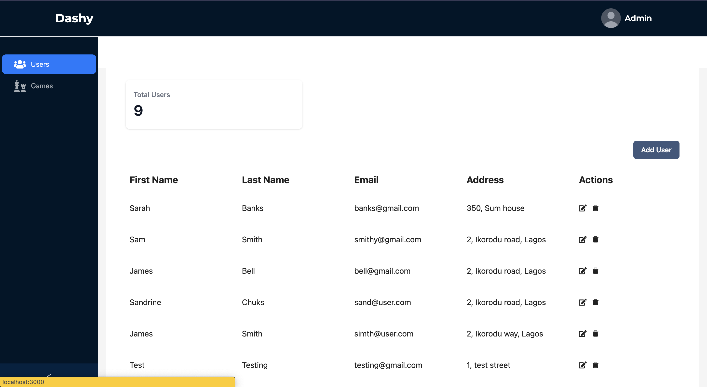

# Dashy
Dashy was built using React Framework and some libraries some of which include tailwind, typescript, Antd, react-hook-form, swr, use-state-with-callback. A comprehensive
list of this libraries are in the package.json file.

